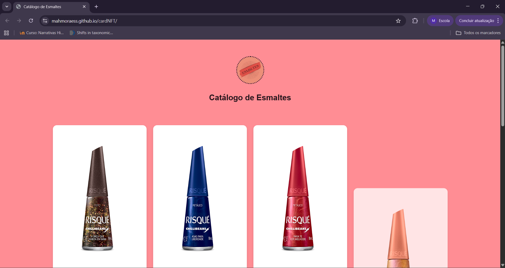
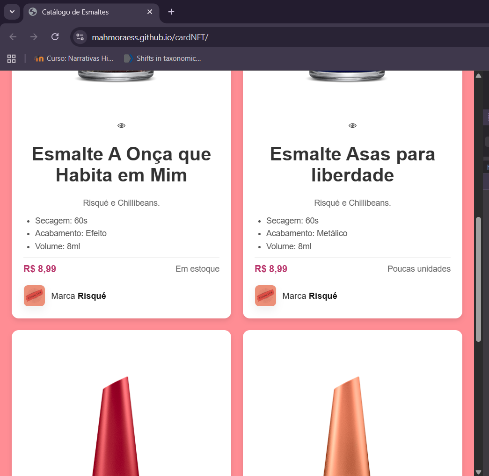

Esmaltes  - Card NFT 

Projeto desenvolvido como parte de avaliação da disciplina de Gerência e configurações de serviços de internet
[Desafio Card NFT](https://www.frontendmentor.io/challenges/nft-preview-card-component-SbdUL_w0U)  
Adaptado para catálogo de esmaltes.

 Tecnologias:
- HTML5
- CSS3
- [Animate.css](https://animate.style/) (animações)
- Git & GitHub (versionamento)
- GitHub Pages (deploy)

 Preview do projeto:
 
 

 Acesso:
Veja o site online: (https://mahmoraess.github.io/cardNFT)

 Autores:
- Maria Antônia Santos Moraes
- Mariani Almeida Silva
- Yasmim Santos Moreira
